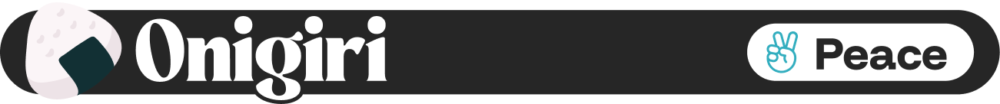

  

<h1 align="center">
	Onigiri (Beta)
</h1>

Onigiri is an add-on that replaces the standard Anki interface with a modern, highly customizable, and personalized dashboard, transforming how Anki looks completely, a way to keep you motivated to study your cards everyday. Onigiri also offers three different types of mini games that allow you to study your cards, level up, take care of your pet Pokémon and build entire islands made of hexagons. 

Onigiri (お握り), also known as omusubi (おむすび) or rice ball (🍙), is a traditional Japanese recipe rich in carbohydrates, which are essential to provide energy, so you can study your Anki cards! This is the intention of Onigiri, to give you the proper motivation to study your cards with a beautiful new layout to Anki (暗記), an extra carbohydrate to give you that boost to study. 

### How the idea was born?

I always heard of Anki as the solution to all of my problems, that it was awesome, that it helped people to memorize everything and learn. However, there was a problem: I didn't know, until very recently, that I had a certain level of OCD that didn't allow me to study using Anki as it was, because I was constantly unease with how it looked. 

Then, during my pre-medical exam season, I decided to start coding Onigiri on my (rather limited) free time, doing tests, posting some reddit research to see what people liked and finally, after months of trial and error (aside from a gigantic fear of people not enjoying my work) I released Onigiri.

Since it's launched, Onigiri has helped over 80k people around the globe, transforming how people study, making them more motivated to pursue their dreams and achieve academic excellence.

### Philosophy

- **Anki is democratic**: Anki is a tool that is used by everyone, from every corner of the world, every user should have the right to adapt it to their own needs, with the colors and aspects that they want. Onigiri helps Anki become an even more democratic and user-friendly experience. 
- **Great design can motivate**: Motivation can bring more productivity and motivation for students to study, to visit the app more often and be drawn to it. Research has prooved that a well-structured and user-friendly design can, in fact, [cultivate motivation](https://www.mdpi.com/2414-4088/2/1/6).
- **Calm defaults, powerful options**: The base experience stays simple. Advanced controls are discoverable, not overwhelming—letting users grow into complexity at their pace.
- **Consistency with flexibility**: Users can change the look and feel without breaking core Anki paradigms—cards, reviews, intervals—so muscle memory still works.
&nbsp;

### Why Onigiri? 

You may wonder "_But Anki works good already, why should I change?_". 
I know, Anki works, but Onigiri helps it feel great to use. By refreshing the interface with calm defaults, readable typography, and gentle cues, Onigiri lowers friction and raise motivation – so you show up to your cards more often, with more energy.

### License

This project is licensed under the `GNU Affero General Public License v3.0 (AGPL-3.0)`. In short: you’re free to use, study, and modify this code—but if you run it as a service or distribute modified versions, you must make your source available under the same license.

I’ve put a lot of time into designing and maintaining this work. Please respect the license and my effort:
- Don’t copy parts of this project into closed-source or commercial products.
- If you build on it, credit the original and keep your changes open.
- If you find value here, consider contributing back or supporting the project.

### Credits and Acknowledgments
The following projects and resources informed the design and development of this add-on:

- Color palettes and themes: [Catppuccin](https://github.com/catppuccin), [Dracula](https://draculatheme.com/), [Rosé Pine](https://rosepinetheme.com/palette/), [Nord](https://www.nordtheme.com/docs/colors-and-palettes), [Solarized](https://ethanschoonover.com/solarized/), [Antinote themes](https://antinote.io/).
- Visual and thematic inspiration: [Mochi Cards](https://mochi.cards/)
- Add-on precedents by Shige: [Enhance main window](https://ankiweb.net/shared/info/911023479), [Rearrange home addons](https://ankiweb.net/shared/info/1797615099), [Anki Re-design](https://ankiweb.net/shared/info/1959668791) (all by Shige)
- Functional and UI guidance: Inspired by [Review Heatmap](https://ankiweb.net/shared/info/1771074083) (by Glutanamite) and [Modern Material Theme](https://ankiweb.net/shared/info/1321246682)
- Hexagon tiles and buildings by [Kenney](https://www.kenney.nl) — licensed under [CC0](http://creativecommons.org/publicdomain/zero/1.0/).
- Pokémon sprites © Nintendo / Game Freak / The Pokémon Company sourced from [PokéAPI sprites](https://github.com/PokeAPI/sprites) and [PokéSprite](https://github.com/msikma/pokesprite).
- Onigimon Mini game adapted from [Ankimon](https://github.com/Unlucky-Life/ankimon) by Unlucky-Life and h0tp, licensed under [GPL-3.0](https://github.com/Unlucky-Life/ankimon/blob/main/LICENSE).

### Notices

First notice: Not affiliated with [Onigiri Anki](https://www.onigiri-anki.com/). No endorsement is expressed or implied.

Onigiri (this add-on) is an independent Anki add‑on that customizes the app’s UI. By contrast, [Onigiri Anki](https://www.onigiri-anki.com/) provides a Japanese study deck with their own system. These are separate products and not affiliated in any way. 

Second Notice: Onigiri does not have monetary intentions, it was born with a philantropic principle and it will continue to be that way. Any in-add-on purchases are to maintain the continuation of the project, being completely optional through coins and icons on the mini-games. 

### Need help? 

I'm currently producing **[Onigiri Guide](https://onigiri-addon-guide.notion.site/Onigiri-Guide-39a3d4f0321380ff86cee5121b443a60)** to help you guys navigate through this add-on. 

### Gratitude

Thanks to the **Anki** and [**Ankimon**](https://github.com/h0tp-ftw/ankimon) community for teaching me the essentials on coding and add-on development! A special thanks to @Ouranos for the special help identifying bugs.

And thank you, the students and users, for using my add-on!

### Support my work

I’m actively shipping updates and new features. If my add-ons helped your studies or workflow, consider supporting my work. Your contribution keeps the project maintained and free for everyone. Join up our [Discord](https://discord.gg/ZU9VZHMk3u)

<a href="https://www.buymeacoffee.com/peacemonk">

 
 
</a>

### Onigiri previews

Coming soon!
